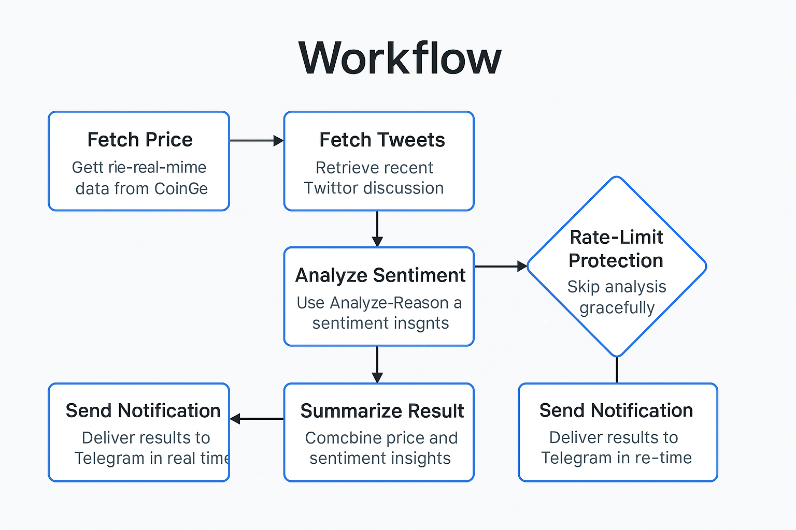
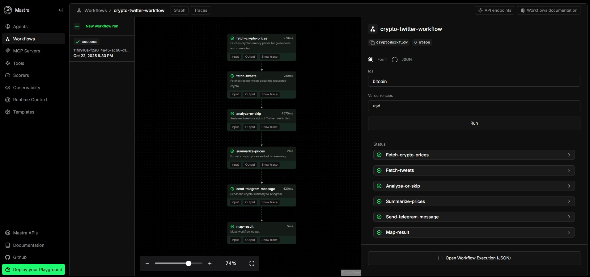

# 🪙 Crypto Price Whisperer

**Crypto Price Whisperer** is an intelligent automation workflow built with **Mastra AI** and **TypeScript**.  
It monitors cryptocurrency prices in real time, analyzes market sentiment from social media, and sends insightful updates directly to Telegram — combining data, reasoning, and automation in one smooth flow.

---

## 🚀 Overview

This project demonstrates how to orchestrate **Agents**, **Tools**, and **Workflows** in **Mastra AI** to create a production-ready automation system.

It integrates:
- **CoinGecko API** — for live cryptocurrency data  
- **Twitter (X) API** — for community sentiment  
- **OpenAI GPT-4o-mini** — for reasoning and natural-language analysis  
- **Telegram Bot API** — for delivering real-time updates  

The workflow fetches market prices, evaluates social mood, explains price trends, and notifies users instantly.

---

## 🧠 Architecture

### 🧩 Agents

#### **Crypto Price Agent**
- **Role:** Primary assistant for cryptocurrency market data  
- **Model:** `GPT-4o-mini` + `cryptoTool`  
- **Capabilities:**
  - Fetch real-time prices via CoinGecko  
  - Report market cap and volume  
  - Handle multilingual crypto names  
  - Suggest actions based on market trends  

#### **Analyze-Reason Agent**
- **Role:** Market interpreter and sentiment analyst  
- **Model:** `GPT-4o-mini` + `twitterTool`  
- **Capabilities:**
  - Analyze latest tweets about a given crypto  
  - Identify prevailing community sentiment  
  - Generate concise reasoning for price movements  

---

## 🔄 Workflow

<p align="center">
  
</p>

1. **Fetch Price** – Get real-time data from CoinGecko.  
2. **Fetch Tweets** – Retrieve recent Twitter discussions about the same crypto.  
3. **Analyze Sentiment** – Use the Analyze-Reason agent to evaluate mood and possible causes for price shifts.  
4. **Summarize Result** – Combine price and sentiment insights.  
5. **Send Notification** – Deliver results to Telegram in real time.  
6. **Rate-Limit Protection** – Skip analysis gracefully when hitting API limits.

---

## ⚙️ Technical Stack

| Layer | Technology |
|-------|-------------|
| Core Framework | [Mastra AI](https://mastra.ai) |
| Language | TypeScript |
| Schema Validation | Zod |
| Database | LibSQL (for memory storage) |
| AI Model | GPT-4o-mini |
| APIs | CoinGecko, Twitter (X), Telegram |

---

## 💡 Key Features

- 🧠 **AI Reasoning** — Context-aware explanations for price trends  
- 🔄 **Asynchronous Steps** — Non-blocking API execution  
- 🪫 **Rate-Limit Handling** — Avoids wasted calls or token use  
- ⚡ **Streaming Responses** — Real-time AI insights via `agent.stream()`  
- 🔐 **Secure Config** — Environment variables for tokens and API keys  

---

## 🔧 Installation & Setup

### 1. Clone the repository
```bash
git clone https://github.com/lciraci/crypto-price-whisperer.git
cd crypto-price-whisperer
```

### 2. Run Mastra AI
```bash
npm install
npm run dev
```
---

## 🧠 Mastra Workflow

<p align="center">
  
</p>